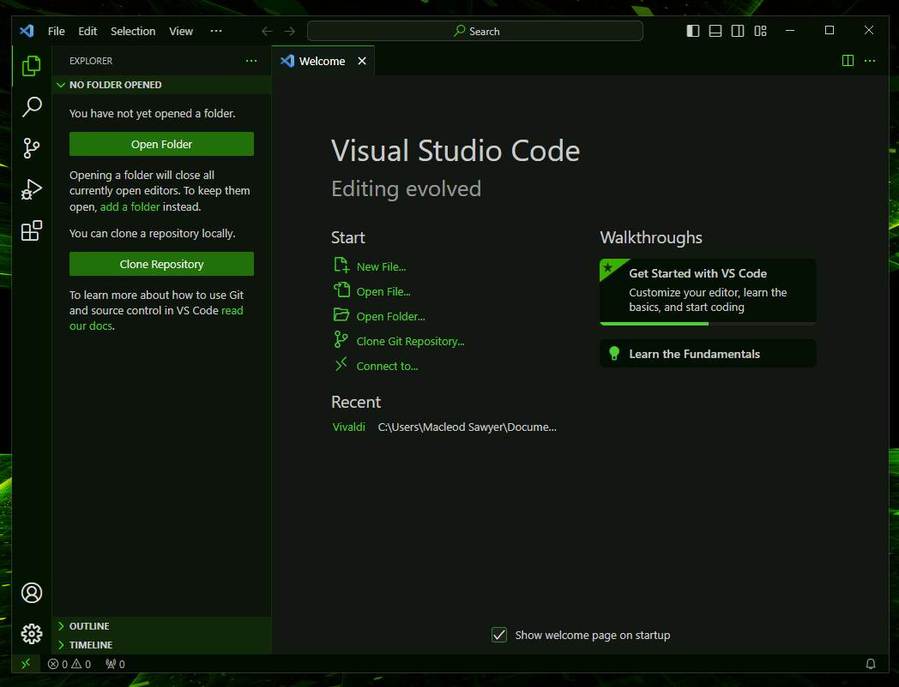
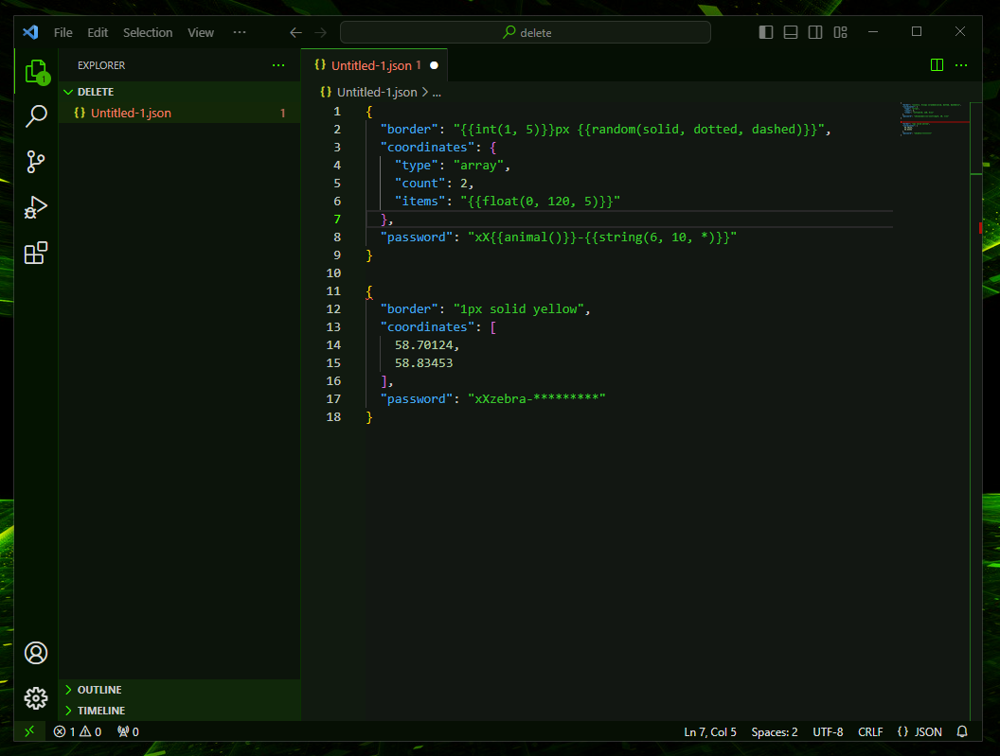
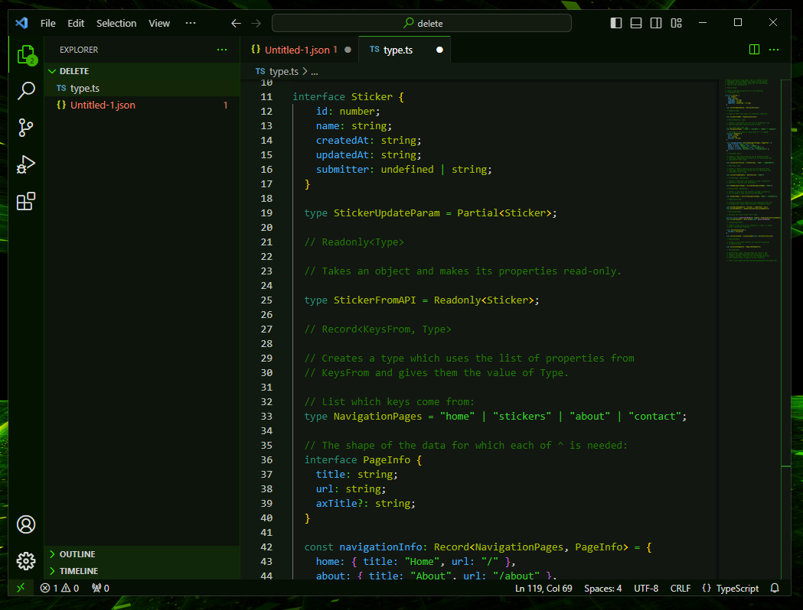
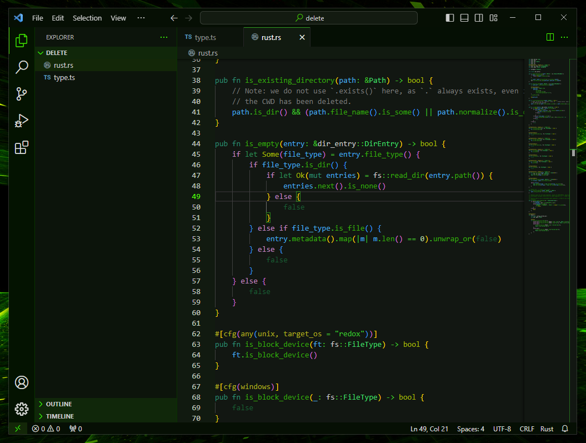

# Darker Green+

A darker green theme that's easy on the eyes. 

I enjoy green themes, but most are too 𝚖𝚊𝚝𝚛𝚒𝚡-like, which is great for the vibes, but not so much for reading and writing. This one is pleasant and decent enough on the eyes to be productive for long hours (trust me, I've used it a lot). 

## [Install on VS Code ⇒](https://marketplace.visualstudio.com/items?itemName=drannex42.vscode-darker-green-plus)

## Screenshot

### Opened folder + json

### Typescript

### Rust

---

[Based on Dark Green+.](https://github.com/Samuel-B-D/vscode-dark-green-plus)
